# IF-ARCHITECTURE-BLUEPRINT v1.0 — kiến trúc hiện hành ghép thành hệ thống như thế nào

> **Lập 19/08/2026** từ Phase A Reconciliation (coverage matrix 52 concept, gate PASS, MISSING major = 0).
> Đây là **bản ghép hệ thống** — trả lời "các mảnh kiến trúc đã chốt LẮP VỚI NHAU ra sao".

## B1 · VAI TRÒ FILE — file này KHÔNG thay thứ gì

| File | Trả lời |
|---|---|
| **IF-ARCHITECTURE-BLUEPRINT (file này)** | kiến trúc hiện hành ghép thành hệ thống như thế nào |
| `00-CHOT.md` | đã quyết gì, khi nào (nhật ký) |
| `ADR-Q0-ARCHITECTURE-DECISIONS-2026-08-19.md` | vì sao quyết (9 ADR ACCEPTED) |
| `scripts/frontier-registry.mjs` | code có theo không (máy kiểm) |
| `docs/memory/LATEST.md` | đang thi công tới đâu |
| `INTERIORFLOW-ARCHITECTURE-MAP.md` | living direction / transition map (24 design direction + tag) |
| `IF-KIEN-TRUC-OS.md` | hiến pháp gốc (18/08) — đứng TRÊN blueprint |

**Luật ưu tiên**: Blueprint conflict Accepted ADR ⇒ **ADR thắng**, báo DRIFT. Blueprint conflict hiến pháp OS ⇒ OS thắng.

## B2 · STATUS LEGEND

`[CHỐT]` Hoà đã chốt thành luật · `[DESIGN DIRECTION]` định hướng chưa thành luật · `[ĐANG CÓ]` code thật đã đo · `[CHƯA CẮM]` code có, chưa nối đường sống · `[GAP]` chưa có code/primitive · `[LEGACY]` thứ cũ còn sống chờ thay · `[OPTIONAL ADAPTER]` ngoài lõi, tháo được · `[UNKNOWN]` chưa đo/chưa quyết, không phán · `[SUPERSEDED]` đã bị đè, cấm hồi sinh · `[MIGRATING]` đang di trú có bảng nâng cấp.

Không nâng status không evidence. `[DESIGN DIRECTION]` chỉ lên `[CHỐT]` khi Hoà dùng từ "chốt" hoặc đối chiếu được sổ.

## B3 · CANONICAL VOCABULARY

Khuôn mỗi term: **NGHĨA · TẦNG (A4) · OWNER · KHÔNG-NHẦM-VỚI · CODE ALIAS**. Rename làm vỡ persist ⇒ KHÔNG rename, chỉ alias.

| Term | Nghĩa canonical | Tầng | Không nhầm với | Code alias / ghi chú persist |
|---|---|---|---|---|
| **Project** | root semantic của mọi thứ — identity + manifest + context + workspaces | L1 | Workspace | Prisma `Project` là MỘT surface theo Manifest, không phải toàn bộ Project |
| **Stage / Chặng** | ống kính nhìn dự án (2D Kỹ thuật · 3D Thiết kế · Trình chiếu) — KHÔNG phải lifecycle bắt buộc | L2 | industry lifecycle (L0) · "3 chặng IF2" (cấm gọi chặng, 07/08) | key persist `concept/render/present` GIỮ TUYỆT ĐỐI |
| **Workspace** | **[CHỐT 19/08 — C3]** môi trường compose quanh MỘT MỤC ĐÍCH: giữ context, compose capability, host Master Tool/Canvas — KHÔNG sở hữu canonical truth. Danh mục CẤP 0.5 (11/08) = các workspace **INSTANCE** chuẩn của IF — hai chốt là một, không đá nhau | L2 | Project · Module · Master Tool · Canvas · Stage | `TaskContext.workspaceId` persisted — không rename |
| **Master Tool / Cửa sổ công cụ** | môi trường làm việc tối ưu cho một loại tác vụ, sống trên canvas, 3 nấc; tên "master tool" ĐÃ KHAI TỬ 16/08 | L3 | Workspace · toolbar | code `ToolWindow` giữ nguyên |
| **Canvas** | shared creative surface — không sở hữu truth của vật đặt lên nó. **[CHỐT 19/08 — C4]**: **Project → nhiều Workspace → mỗi Workspace nhiều Canvas/Board**; đồng thời MỘT **Project Flow / Project Timeline** xuyên suốt nối chúng ("dây chuyền không đứt" — phần graph nối này [DESIGN DIRECTION], chưa primitive). Canvas KHÔNG độc lập về dữ liệu — cùng tham chiếu Project truth/DNA/decisions/materials, không copy thành thế giới mới. Phân vai: **Canvas = working surface · Workspace = working context · Project = identity + truth + genealogy** | L2 | Workspace · Doc | code `FlowCanvas`, dữ liệu `Flow.graphJson` |
| **Node** | node đồ thị canvas (port · giá · runner) | L2/L3 | NODE unit-of-work (N9 — [UNKNOWN], CẤM mượn chữ Node cho nó) · mode "Node↔3D" chặng 2 | `lib/nodes/registry` |
| **Flow** | model đồ thị canvas (`Flow.graphJson`) | L3 | "workflow" (quy trình — dùng chữ workflow) | Prisma `Flow`/`FlowVersion` persisted |
| **Library / Master Library** | MỘT thư viện duy nhất — content đã hiểu, đã normalize, tái dùng; hiểu ngữ cảnh và mang đồ tới | L3 | Files (raw) · "thư viện vật liệu" (nghĩa hẹp SAI — vật liệu là một KỆ, màu là một BƯỚC) | `lib/library` · `LibraryAsset` |
| **Files** | raw/project inputs, HAI TẦNG (thư mục hệ thống 5 loại + Collection+ 8 gói) — upload ≠ knowledge | L3 | Master Library · "chợ đầu mối" [SUPERSEDED] | `/files` · `lib/filemanager` |
| **Gateway** | **[CHỐT 19/08 — C1]** "Gateway" trần = **AI Gateway** (`lib/ai/gateway.ts` tương lai, Wave 2); `lib/gateway/` code GIỮ NGUYÊN, mọi docs gọi nó là **Format Router** (detect đuôi tệp → capability). M-01 RESOLVED 19/08 | cross | AI Gateway ≠ Intelligence Policy | `lib/gateway/` không rename |
| **Version** | technical/data evolution (format version, snapshot per run) | cross | Revision · Checkpoint | `FlowVersion` · `IDF_VERSION` — khác tầng, khai ánh xạ |
| **Checkpoint** | intentional snapshot để review/compare | L4 | control point (nghĩa OS "Delegate dừng ở checkpoint" — gọi là control point) | 0 code — [GAP] |
| **Revision** | professional project state/release identity (Q6) | L4 | field `rev` Int = **rev token** (optimistic-lock, 0 enforcement — blocker ⑤) | `ProjectRevision` chưa có; KHÔNG rename `rev` |
| **Issued / Frozen Revision** | released externally / immutable revision | L4 | live derived state | [GAP] — Q6 Wave 3 |
| **Decision** | DesignDecision — first-class domain: ai quyết · gì đổi · trước/sau · lý do · status `proposed\|selected\|rejected\|approved\|clientApproved` (Q8) | L4 | "chốt" trong sổ vận hành build (khác tầng) | 0 code — Wave 3 |
| **Snapshot** | immutable capture; 3 loại theo mục đích: PORTABLE (Q2) · FROZEN (Q6) · DIFF (Q8 before/after) | cross | live reference | `FlowVersion.graphJson` là snapshot per-run |
| **DNA** | pattern/model học từ evidence, 4 scope Studio/Person/Client/Project → Contextual DNA (Q9) | L5 | Memory (evidence/history) · prompt AI | code hiện chỉ Project-scope `uploads/dna/` |
| **Memory (IF Memory)** | semantic knowledge layer — evidence · relationship · history (Person·Project·Client·Material·Supplier·Space·Decision·Issue·Feedback·Lesson·Standard) | L5 | DNA · `docs/memory/` (trí nhớ quy trình build, KHÔNG phải sản phẩm) | [GAP] — gần nhất là Notebook RAG (đang rỗng) |
| **Asset** | canonical library asset (metadata + managed binary) | L3 | "tài sản studio" (idfc/PBR/màu/brand-kit — nhóm store khác, W0.3) | `LibraryAsset`; `AssetBlob` = đề xuất Q4 |
| **Material** | semantic identity của vật liệu — **matId = IF-owned immutable UUID [CHỐT 19/08]**; mọi mặt khác là representation | L3 | `sku` (business key, mutable) · `ProductSpec.id` · specId | 3 namespace cũ đã giải ở BOQ (W0.2: `BoqRow.specId` required + `matId` alias @deprecated) |
| **Component** | canonical reusable content `.idfc` (12 kind) — template ≠ instance; instance = reference + overrides (Q3). **[CHỐT 19/08 — C2]: overrides THẮNG variant** — effective = template → variant → overrides đè cuối. M-03 RESOLVED 19/08 | L3 | React component (tầng kỹ thuật) | `variant` field giữ (persisted), vai preset |
| **Scene** | derived 3D representation từ Doc — runtime, KHÔNG persist (khớp Q6) | L3 | Scene model (đã hoãn có chủ đích) | `docToObjScene` |
| **Pro** | persistence key `cadMode='pro'` + nhãn "Chuyên"; professional depth thuộc capability, KHÔNG phải architecture mode | L3 | tier sản phẩm | key `sketch/pro/revit` GIỮ TUYỆT ĐỐI |
| **Render** | output của Visual Pipeline (không là con riêng của 3D) | L3 | stage key `render` (nhãn "Thiết kế 3D") | key giữ |
| **Present** | Communication + Review + Issue layer — không phải slide editor | L2/L3 | stage key `present` | key giữ |
| **IDF / IDFC / IDFP / IFPACK** | xem B12 | cross | — | tên đuôi KHÔNG đổi (Appendix B ADR) |

## B4 · MASTER ARCHITECTURE SPINE

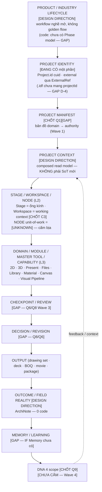

**Cross-cutting (áp mọi tầng)**: Canonical Data/Authority (B8) · Deterministic Core (B14) · AI/ML (B14) · Human Control (B14) · Persistence/Portability (B17) · Version/Provenance · Conflict/Merge (`rev` token — 0 enforcement, blocker ⑤) · Permissions/Privacy ([GAP] — Privacy mode 0 UI) · Optional Adapters (B18).

## B5 · PROJECT OPEN SEQUENCE — IF hiểu dự án TRƯỚC khi restore panel

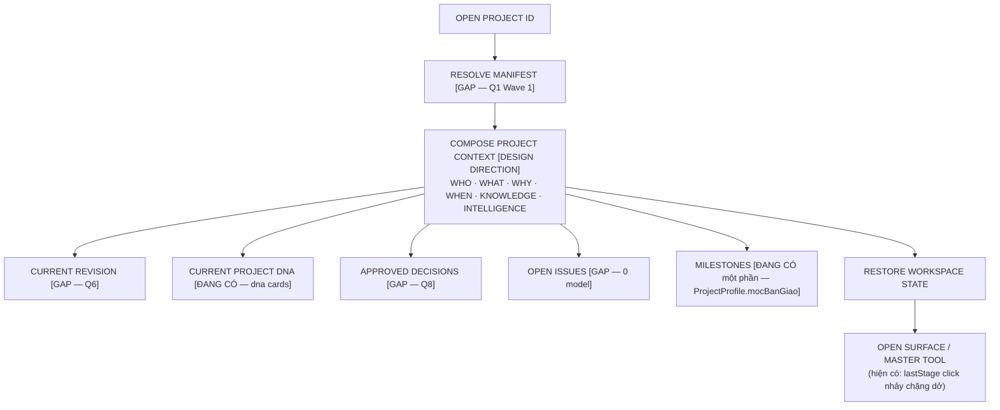

Thứ tự semantic (N7): WHO → WHAT project → WHICH revision → WHAT was I doing → approved/open/context, **rồi mới** tool/canvas/panel. Tách 3 loại state [CHỐT lưu chung↔máy]: **DOMAIN STATE** (chung) · **WORKSPACE STATE** (chung — dây chuyền, vị trí node) · **UI STATE** (máy mình — nấc, cỡ kéo tay, panel thu/mở).

## B6 · WORKSPACE MAP

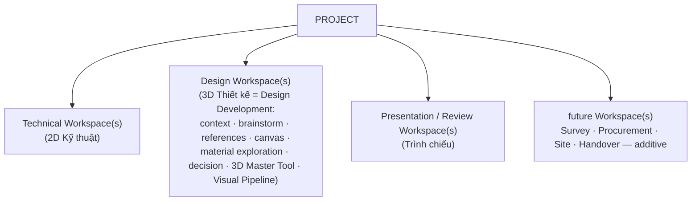

**[CHỐT 19/08 — C3 + C4] Mô hình phân tầng Project / Workspace / Canvas:**

```
Project (identity + truth + genealogy)
├─ Concept Workspace
│   ├─ Brainstorm Canvas
│   ├─ Option A Canvas
│   └─ Option B Canvas
├─ 3D Workspace
│   ├─ Design Development Canvas
│   └─ Material Study Canvas
└─ Presentation Workspace
    └─ Story/Deck Canvas
```

- **Workspace = working context** (C3): compose quanh một mục đích; danh mục CẤP 0.5 (11/08) = các workspace INSTANCE chuẩn. **Canvas = working surface** — mỗi Workspace có thể nhiều Canvas/Board (C4). **Why (Hoà nêu)**: sau C3, Workspace đã là tầng chứa context — ép 1 Canvas duy nhất cho cả Project thành "siêu mặt bàn" quá tải khi dự án có brainstorm, concept A/B, material study, technical review, presentation, nhiều người, nhiều revision.
- **MỘT Project Flow / Project Timeline xuyên suốt** (lifecycle/context graph) nối các workspace/canvas ⇒ trải nghiệm vẫn "dây chuyền không đứt". Phần graph nối = [DESIGN DIRECTION] (chưa có primitive trong code); mô hình phân tầng = [CHỐT].
- **Canvas KHÔNG độc lập về dữ liệu**: cùng tham chiếu Project truth · Design DNA · decisions · revisions · materials · files; kết quả chốt ở Brainstorm thành context đầu vào cho 3D/Presentation mà KHÔNG copy thành thế giới mới (khớp direction #5).
- KHÔNG phải ba workspace bắt buộc — mở thẳng 2D/3D/Present, nhiều canvas, nhiều project, mở Master Tool trực tiếp đều hợp lệ (luật X1–X4 + Gate B: không stage-gate cứng, 10 cách dùng coexist).
- Workspace **references** Project Context + canonical domains, **composes** capabilities, **hosts** Master Tools/Canvas, **restores** context — **KHÔNG sở hữu** project truth.
- Multi-project (N8): mọi domain đã scope theo `projectId` [ĐANG CÓ]; isolation của workspace-state khi mở song song nhiều dự án = [UNKNOWN], không copy canonical data để restore.
- Sidebar TRÁI = **CHỈ CÓ VIỆC**, **HAI ĐẢO** (A Xưởng/Việc: Trang chủ·Dự án·Files·Thư viện·Soát
  duyệt · B Chặng: 2D·3D·Trình chiếu), tách bằng khoảng thở, **giữ tách ở cả ba nấc kể cả rail**;
  ba độ sâu Rail 52-56 / Shelf 220-280 / Panel 320-440 [CHỐT 20/08 muộn — Navigation Override].
  Cá nhân/hệ thống chuyển hẳn lên **cụm phải-trên** `[Thông báo][Hiện diện][Ảnh đại diện]`,
  **cấm lặp ở trái**. Xem SUPERSEDED #7 và #9.

## B7 · MODULE / MASTER TOOL / CAPABILITY

Ba khái niệm: **MODULE** = vùng sở hữu domain + contract · **MASTER TOOL** = môi trường thao tác sâu trên canvas (`ToolWindow`) · **CAPABILITY** = năng lực khai qua registry (`commands/registry` · `gateway/capabilities` · `nodes/registry` — ~70% contract đã tồn tại, Gate B).

| Unit | Type | Accepts | Produces | Reads | Owns | Must NOT own |
|---|---|---|---|---|---|---|
| Files | Module | raw upload (PDF·DWG·ảnh·audio·Excel) | ProjectFile/raw entries [GAP — Q5] | project context | raw stage, hai tầng | canonical library content |
| Master Library | Module | promoted/normalized content | `.idfc` · LibraryAsset · đề xuất đúng chỗ | matId · DNA · ngữ cảnh chặng | canonical reusable content + identity | raw file đời sống · project instance |
| 2D Kỹ thuật | Module + Master Tool (CAD editor) | Doc · `.idf` · block/idfc insert | bản vẽ · PDF/DXF export · camera placement | Material (hatch) · specs | Doc CAD (qua disk-sync B4) | 3D scene · giá |
| Design Workspace (3D) | Workspace | context · references · Doc | decisions [GAP] · render · scene view | DNA · Library · Visual Pipeline | — (compose) | canonical domain truth |
| 3D Master Tool | Master Tool | Doc → derived scene | spatial edit · camera · placement · material assignment | matId PBR · BuildRecipe | geometry/scene/camera EDITING | toàn design process · persist scene |
| Canvas | Surface | mọi reference (material·asset·image·drawing·3D view·render·spec·decision·comment) | bố cục dây chuyền (`Flow.graphJson`) | canonical objects by id | graph layout | truth của object đặt lên nó ([GAP-OWNERSHIP A-5: graphJson mồ côi authority]) |
| Visual Pipeline | Capability (shared) | scene·image·sketch·photo·render·frame | preview·i2i·relight·upscale·composite·HQ render·video frame | AiTier/fidelity | pipeline execution | domain data; provider cụ thể (đi qua AI Gateway [GAP Wave 2]) |
| Present | Module | 2D·3D·canvas·render·material·spec·BOQ·photo·video·decision | drawing set·deck·movie playback·client/technical package·issued revision [GAP] | mọi domain (read) | deck `.idfp` · layout | sản xuất nội dung mới (video TẠO+DỰNG ở chặng 2 — chốt 13/08) |
| BOQ | Capability | Doc + specs (chỉ số ĐO ĐƯỢC — chốt 15/08) | bảng khối lượng + overrides người sửa | specId (required, W0.2) | compute + override store | số ước tính từ ảnh · giá chép cứng |
| Knowledge/Memory | Module [GAP] | notebook sources · observations · lessons | RAG answers · memory queries | — | semantic memory schema riêng (OS §4d) | format memory của model AI |
| AI | Layer | task + composed context | proposal/operation | context contract B14 | KHÔNG GÌ CẢ | canonical mutation · identity · validation |
| ArchiNote boundary | Adapter contract | field data (photo·voice·measure·observation) | Observation/Issue [GAP Wave 5] | shared contracts (Project·Material·Location·Decision·Revision) | field reality | IF internals (store/UI) · Lark bắt buộc ở giữa |

## B8 · DOMAIN AUTHORITY MAP

Nguyên tắc [CHỐT Q1]: KHÔNG có "Prisma là SoT toàn app" — mỗi semantic domain đúng MỘT authority; Manifest là bản đồ (chưa viết — Wave 1).

| Domain | Identity | Canonical Authority | Writers | Readers | Runtime | Portable | Cache | External |
|---|---|---|---|---|---|---|---|---|
| Project metadata | `Project.id` cuid | Prisma | routes | 12 file | stores | [GAP] .idf chưa mang projectId (D-4) | — | ExternalRef (`larkProjectCode` [LEGACY] 13 file đọc thẳng) |
| CAD Doc (2D) | entity id per-Doc (A-7: chưa đủ anchor xuyên project) | **Đĩa `.idf`** (chốt B4 disk-sync) | CAD editor | 16 file import/export | `useCadStore` (Q7: store KHÔNG là business authority — [CHỐT], thi công Wave 3) | `.idf` v2 (live-only; snapshot v3 = Q2) | IDB autosave `interiorflow-sheets` | — |
| Present deck | deck/slide id | Đĩa `.idfp` v1 | Present editor | 5 file | — | `.idfp` (tự chứa nhất) | IDB autosave | — |
| Material (semantic) | **matId UUID [CHỐT]** | Prisma `ProductSpec.matId` [MIGRATING — cột chờ Hoà push, drift DB = đúng 1 cột] | server specs (client KHÔNG tự đặt matId) | resolver `getMaterial()` 2 đường `uuid\|legacy-sku` | — | Q2 snapshot [GAP] | PBR store re-key canonical (W0.2) | ATLAS sync [UNKNOWN — chưa từng chảy dữ liệu, D-6] |
| Material PBR (representation) | matId key | PBR store (IDB-bound qua W0.2/W0.3) [MIGRATING từ localStorage] | material tool | 3D/quả cầu | — | trong `.idfc` material | in-memory | — |
| Component/content | `.idfc` `meta.id` (`meta.code` business-key — đè im lặng khi trùng = [GAP], Q3 giải) | kho `.idfc` studio — IDB bridge (W0.3, [MIGRATING] từ localStorage) | Library | 65 file entity | — | `.idfc` v3 | in-memory | — |
| Library asset binary | `LibraryAsset.id` cuid | Prisma + `./uploads/` managed copy | ingest routes | 19 file | — | — | — | Q4 contentHash/provenance [GAP] |
| Canvas graph | `Flow.id` | Prisma `Flow.graphJson` — ⚠️ **[GAP-OWNERSHIP A-5]**: domain duy nhất mất-DB-mất-trắng, chưa ADR nhận nuôi | FlowCanvas + nodes | 162 file (god-store B-1) | `useFlowStore` | KHÔNG | FlowVersion snapshot | — |
| Tasks / Workflow | `Task.id` | Prisma (Task · WorkflowState — có thật, đã push 08/08) | routes | UI | — | — | — | LarkTaskRef mirror pull-only [OPTIONAL ADAPTER] |
| BOQ overrides | `specId` (required — W0.2) | IDB `boq-overrides` (migration-on-read) | người sửa tay | BOQ compute | — | trong frozen revision [GAP Q6] | — | — |
| Decision | — | **[GAP — Q8 Wave 3]** (Prisma + JSONL mirror portable) | — | — | — | JSONL | — | — |
| Revision (frozen) | — | **[GAP — Q6 Wave 3]** | — | — | — | zip snapshot | — | — |
| DNA | projectId | Đĩa `uploads/dna/<projectId>/cards.json` (4-scope = Q9 Wave 4) | DistillEngine (2 caller) + panel | 5 file | — | JSON | — | — |
| Brand Kit / màu / refManifest | per-studio | IDB bridge (W0.3 [MIGRATING]) | settings | present/export | — | export JSON (nút UI = nợ) | — | — |
| Location / Site | — | **[GAP]** — ProjectProfile 0 trường vị trí (chốt 15/08 đã nhận) | — | — | — | — | — | — |
| Issue / Observation | — | **[GAP — Wave 5, ArchiNote]** | — | — | — | — | — | — |
| Client identity | — | **[GAP]** — 0 model (chỉ Client DNA có ADR Q9) | — | — | — | — | — | — |

## B9 · DATA LIFECYCLE

```mermaid
flowchart LR
  RAW["RAW<br/>(Files — Q5 GAP:<br/>code hiện upload = LibraryAsset ngay)"] --> UND["UNDERSTOOD<br/>(cửa sổ công cụ thêm định nghĩa)"]
  UND --> CAN["CANONICAL<br/>(Master Library · matId · .idfc)"]
  CAN --> DER["DERIVED<br/>(3D scene · BOQ compute · live representation — Q6)"]
  DER --> INST["PROJECT INSTANCE<br/>(reference + overrides — Q3)"]
  INST --> OVR["OVERRIDE<br/>(entity.hatchOverride · BOQ override ·<br/>[CHOT C2] template -> variant -> overrides de cuoi)"]
  OVR --> CP["CHECKPOINT [GAP Q6/Q8]"]
  CP --> FRZ["FROZEN / ISSUED [GAP Q6]"]
  FRZ --> ARC["ARCHIVE (.ifpack · backup-offsite)"]
```

Domain áp dụng: Material đi đủ RAW→…→OVERRIDE [một phần ĐANG CÓ] · CAD Doc sống ở CANONICAL(đĩa)→DERIVED(3D) · Present ở INSTANCE→(FROZEN [GAP]) · Files↔Library là ranh RAW↔CANONICAL. Snapshot đã phát hành **không tự đổi theo design hiện tại** [CHỐT Q6]. Khi cả snapshot lẫn DB có spec: hiển thị bản nào = [UNKNOWN — U-Q2-02, Hoà quyết].

## B10 · REPRESENTATION MAP — một semantic object, nhiều representation, KHÔNG nhiều truth

| Semantic object | Representations | Nguyên tắc |
|---|---|---|
| **Material (matId)** | Semantic · 2D Hatch (`MaterialDef` + `hatchOverride` delta) · PBR · Commerce (`ProductSpec` — TRỎ TỚI, không chép giá) · Source binary · Provenance · Supplier offer [GAP] · Instance override | 2D/3D/Present/BOQ đọc mặt phù hợp từ CÙNG matId — "đồng bộ = không tách ra ngay từ đầu" |
| **Component (.idfc)** | ký hiệu 2D · geom 3D · params · giá · thumbnail | template → instance (reference + overrides); một chiều kho→dự án; **effective = template → variant → overrides đè cuối [CHỐT 19/08 C2]** |
| **Image/Render** | LibraryAsset · dataURL trong deck · node result | provenance origin [GAP Q4] |
| **Drawing** | Doc → sheet → PDF/DXF export | export tại nguồn 2D được phép [ĐANG CÓ] |
| **Scene** | derived từ Doc, runtime-only | không persist [CHỐT-consistent Q6] |
| **Pattern/hoạ văn** | định nghĩa → 2D hatch · tile layout · 3D mapping · render texture · present sample | [DESIGN DIRECTION][GAP] — entry `xuong-hoa-van-parametric`; không nhốt semantic vào CAD |
| **Present sample** | bảng vật liệu xếp chồng = bản nộp y bố cục màn | id trên phối cảnh = TRÌNH BÀY, con số = chỗ đo được [CHỐT 15/08] |
| **Decision** | timeline entry · review card · DNA learning input | [GAP Q8] |

Shared representation ≠ shared ownership [DESIGN DIRECTION #23 — chưa thành luật máy kiểm].

## B11 · REVISION / DECISION DAG

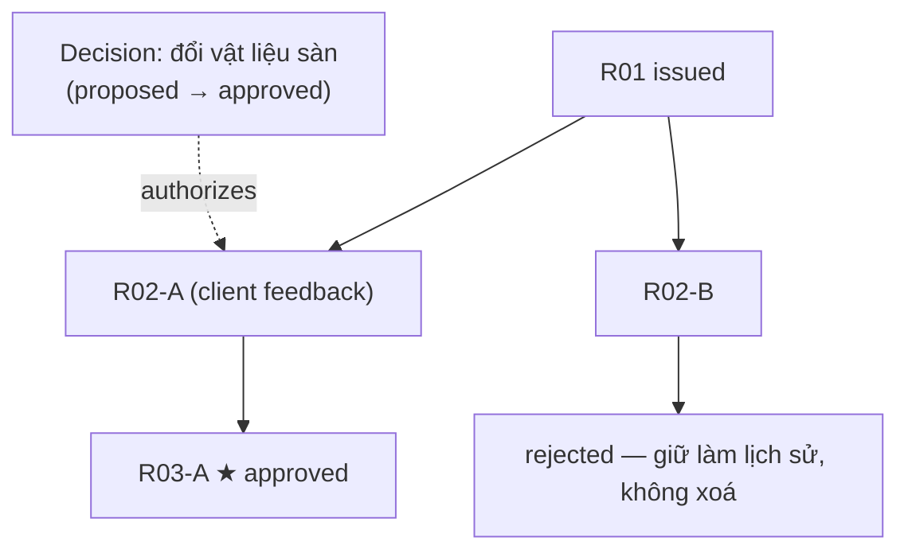

- **Tách 6 chữ** (B3): Version ≠ Checkpoint ≠ Revision ≠ Decision ≠ Issued ≠ Frozen — không dùng thay nhau.
- Hiện trạng: chỉ `FlowVersion` (Version) tồn tại. Checkpoint/Revision/Decision = [GAP — Q6+Q8 Wave 3].
- BRANCH/DAG cấp Revision: [DESIGN DIRECTION] — model Q6 đề xuất hiện là danh sách phẳng; branch sống trước ở `Decision.parentDecisionId` (Q8). Non-destructive (checkpoint → branch → modify → compare → regenerate downstream) = [DESIGN DIRECTION]; nền đã có: BuildRecipe stack non-destructive [ĐANG CÓ] + OS return-to-step-N.
- Creative Timeline = **Decision history**, không phải list file revision [CHỐT vision OS].

## B12 · FILES / LIBRARY / FORMAT MAP

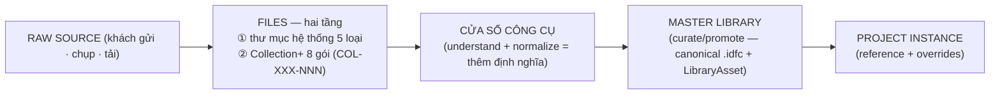

| Format | Scope | Identity | Version/migration | Ghi chú |
|---|---|---|---|---|
| `.idf` | MỘT dự án — **portable CAD design state theo code hiện tại, KHÔNG phải toàn bộ IF project** (code chứng minh: sheets+Doc, không specs/deck/DNA) | meta mang TÊN, chưa mang projectId [GAP D-4] | v2, migration thật; v3 = +productSpecSnapshots (Q2, live/share mode) | live reference + portable snapshot [CHỐT Q2] |
| `.idfc` | MỘT nội dung tái dùng ("C" = CONTENT) | `meta.id` (`meta.code` mutable — identity yếu, Q3 giải) | v3, vỏ chung + ruột theo 12 kind | một chiều kho→dự án · bản chèn giữ liên kết + đè cục bộ · ghim phiên bản |
| `.idfp` | MỘT hồ sơ Trình chiếu | — | v1, tự chứa nhất (dataURL + brandKitSnapshot cố ý) | portable present state |
| `.ifpack` | sao lưu ZIP cả dự án | — | 3 tầng thoái lui | SNAPSHOT/backup |
| ~~`.idfnotes`~~ | **MA — 0 code** | — | — | dựng hoặc khai tử; cấm trích dẫn như đang sống |

Điểm mềm chung (Gate A3): validate nông (prims chỉ `Array.isArray`) — backward compat dựa kỷ luật additive, chưa máy canh. Bốn format cần một xương sống lưu chung (version · nâng cấp · nhãn nguồn · integrity) [DESIGN DIRECTION].

## B13 · DESIGN INTELLIGENCE MAP

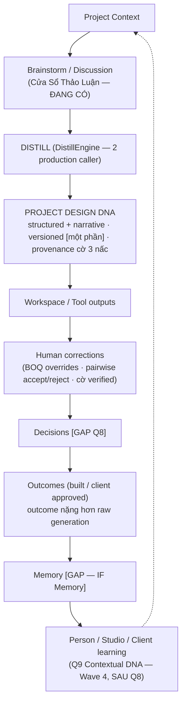

- Project DNA = authority của dự án hiện tại; Person/Studio/Client DNA = context + recommendation — **không override project truth tự động** [CHỐT nguyên tắc Q9].
- DNA ≠ Memory: Memory lưu evidence/relationship/history; DNA là pattern học từ đó. Không biến DNA thành kho chứa mọi thứ.
- Learning loop GENERATED → HUMAN MODIFIED → DELTA → SELECTED/REJECTED → APPROVED → CLIENT APPROVED → BUILT → FIELD OUTCOME → SIGNAL → MEMORY → DNA: 5 signal đã sống rời rạc trong code [CHƯA CẮM]; chuỗi nối qua Q8.
- Client understanding (N5): Client identity [GAP — 0 model] ≠ Client DNA (Q9) ≠ project-specific client context; một feedback trong một project KHÔNG tự thành Client DNA toàn cục — learning cần evidence.
- ML không tự thành canonical authority: evidence-backed · scoped · versionable · inspectable · không silently rewrite [CHỐT nguyên tắc].

## B14 · AI CONTROL MAP

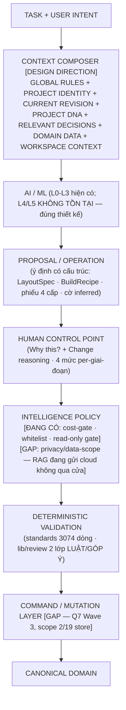

- **Invariant [CHỐT luật 8]**: AI/ML KHÔNG ghi thẳng canonical domain truth. Đo 19/08: **0 RED** (Gate C-1). Không có mũi tên AI → DB.
- Hai [GAP] đã ghi nhận (C-5): AI image persist vào `Flow.graphJson` không cờ draft/approved · embeddings NVIDIA vào NotebookChunk không cờ origin — thành vấn đề khi Q6 Frozen ra đời.
- **AI Gateway ≠ Intelligence Policy** [CHỐT phân biệt]: Gateway = provider/model/local-cloud/fallback/execution (hiện 2,5 gateway song song — blocker ④, facade Wave 2) · Policy = được gọi không/privacy/scope/AI level/authority/checkpoint/mutation permission ([GAP] phần privacy).
- **Deterministic core** không giao AI: identity · schema · geometry · numeric rules · validation · versioning · mutation contracts · conflict rules · domain invariants. Kiểm chuẩn = MÁY, AI chỉ góp ý và góp ý KHÔNG BAO GIỜ chặn [CHỐT 07/08 + 15/08].
- AI Layers: L0 Deterministic [dày] · L1 Adaptive (PairwisePerceptron · DistillEngine rule-based) · L2 Assist (Vitals/RAG/VLM) · L3 Collaborate (image-gen nodes, người duyệt + credit gate) · L4 Delegate / L5 Autopilot = không tồn tại, đúng chốt A15. Không gọi mọi automation là AI.

## B15 · VISUAL / CAMERA / MOVIE MAP

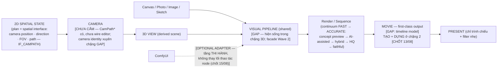

Movie compose được: camera path · 3D render · still · AI frame · video · diagram · text · audio · design/construction/field state [DESIGN DIRECTION] — không build movie engine trong nhiệm vụ này.

## B16 · PRESENT / REVIEW / ARCHINOTE MAP

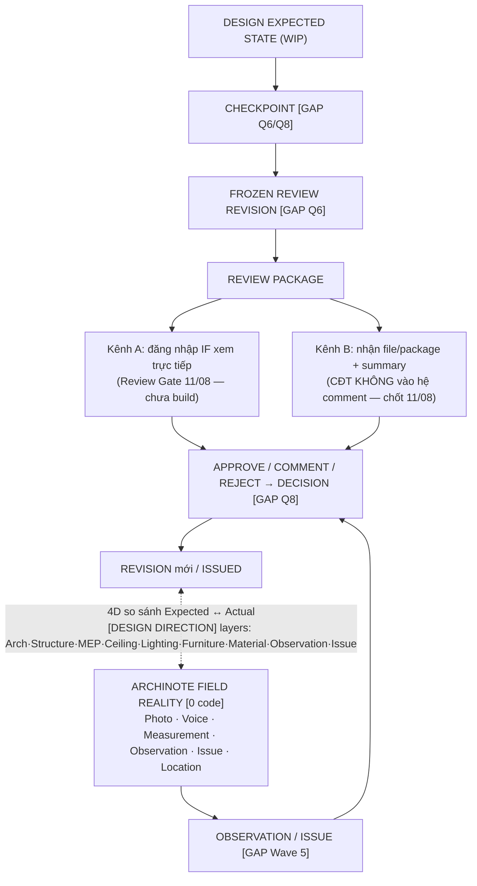

- Hai delivery channel, **MỘT checkpoint truth**. Milestone/review date thuộc Project Context.
- ArchiNote nối qua **SHARED DOMAIN CONTRACTS** (Project · Asset · Material · Location · Observation · Issue · Decision · Revision) + HTTP API + `ExternalRef.system='archinote'` (cửa 0-migrate). **Lark KHÔNG bắt buộc nằm giữa [CHỐT 19/08]** — đè doctrine 03/08 "chung nguồn qua ATLAS/Lark".
- Ba điều kiện trước khi build ArchiNote: conflict/merge primitive (D-3, Wave 3 gộp Q8) · `.idf` mang project id portable (D-4, Wave 1) · Observation/Decision model (Wave 3/5). IF ≠ BIM clone.

## B17 · PERSISTENCE / PORTABILITY

| Store | Chứa | Tag |
|---|---|---|
| **Prisma SQLite** | Project · Task/WorkflowState · Flow.graphJson · Notebook · ProductSpec · LibraryAsset metadata · ExternalRef (bảng có, 0 bản ghi, cờ code stale) | CANONICAL per-domain (theo B8). ⚠️ drift DB thật = **đúng 1 cột `ProductSpec.matId` chờ Hoà push** [MIGRATING]. `prisma generate` trước push = chết runtime (đã chứng minh 2 lần) |
| **Disk** | `.idf`/`.idfp` autritative (B4 disk-sync) · `./uploads/` binary · `uploads/dna/` cards | CANONICAL |
| **IndexedDB** | `interiorflow-sheets` autosave (CACHE) · BOQ overrides (CANONICAL, specId-keyed W0.2) · 4 kho studio idfc/màu/BrandKit/refManifest (CANONICAL, [MIGRATING] bridge từ localStorage — W0.3) | CACHE + CANONICAL + MIGRATING |
| **localStorage** | preference · transient · cache · bridge nguồn (giữ nguyên trong window) · PBR store (dời sau — vùng W0.2) · gallery.v1/customTemplates/customRules/boq-custom-columns (nợ W0.3) | LEGACY/MIGRATING + preference |
| **`.idf`** | portable CAD state | PORTABLE (live-only; snapshot mode = Q2) |
| **`.idfc`** | canonical reusable content | PORTABLE + CANONICAL content |
| **`.idfp`** | portable present state | PORTABLE (tự chứa) |
| **`.ifpack` / backup-offsite** | sao lưu | SNAPSHOT |

**Wave 0 status THỰC (N44)**: W0.2 (BOQ namespace) + W0.3 (studio assets IDB) = **xong-MÁY, chưa browser-verified, chưa commit**; runbook DB đã soạn, **Hoà chưa chạy** push/backfill. Machine-complete ≠ human/browser verified — cấm nâng.

## B18 · EXTERNAL ADAPTER RING

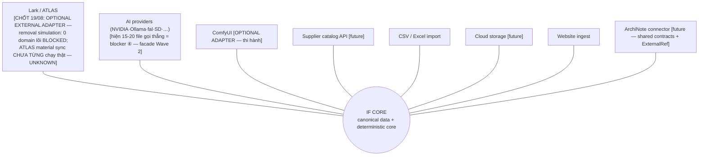

Luật [CHỐT]: **DEPEND ON TOOL = chấp nhận. DEPEND ON EXTERNAL DATA OWNERSHIP = không.** External adapter không sở hữu IF canonical identity (matId đã tách khỏi ATLAS record id). Dữ liệu phải export/restore được không cần adapter. Nợ pháp lý ngoài vòng: `libredwg-web` GPL-3.0 treo tới trước phát hành.

## B19 · UPDATE LOCALITY / EXTENSION TEST

Hai luật [FINAL-AUDIT §24 — Hoà accept audit, chưa vào registry luật]:
- **B-1**: NEW CAPABILITY MUST ENTER THROUGH A CONTRACT (registry entry · format capability · node def · declared handoff) — never through another module's store/schema/internals.
- **B-2**: REPLACING A MODULE MUST NOT REQUIRE EDITING UNRELATED MODULES.

| Extension | Contract vào | Module đổi | KHÔNG được đổi | Hiện trạng |
|---|---|---|---|---|
| New Workspace/Stage (Survey·Video…) | stage-registry [GAP — ~4 file shell chép tay] | shell + registry | domain modules | 🟡 |
| New Master Tool | ToolWindow + commands/registry | tool mới | canvas core · store khác | 🟡 (B-1 god-store: 3D/Library/nodes đang GHI NGƯỢC useCadStore — 4 chỗ đo được) |
| New Material facet | representation resolver (`getMaterial`) | lib/materials | 2D/3D/Present readers | 🟢 sau khi cắm M-05 |
| New AI provider | **AI Gateway facade [GAP Wave 2]** | gateway | mọi callsite | 🔴 ARCHITECTURAL COUPLING (blocker ④) |
| New render backend | Visual Pipeline | pipeline | domain | 🟡 (three gói trong 20 file, 1 rò `chuan-net.ts`) |
| New output type (Present) | capability registry + handoff contract [GAP — 3 handoff chép tay B-4] | present | 2D/3D | 🟡 |
| New Movie backend | Visual Pipeline + timeline model [GAP] | movie | — | 🟡 |
| New ArchiNote capability | shared contracts + ExternalRef | adapter | IF internals | 🟢 (boundary đúng sẵn) |

Nghiệm thu định kỳ: chạy lại bảng 12-future-changes; case tụt màu = regress. Máy soi `soi:ranh-gioi` = entry mở, **chưa build** (5 máy soi hiện có mù cả 5 blocker).

**Extension rationale (Hoà nêu khi chốt C4)**: mô hình phân tầng Project → Workspace → Canvas + Project Flow xuyên suốt là thứ **mở đường** cho collaboration · branching option · revision · movie · ArchiNote · workflow mới — thêm workspace/canvas loại mới là ADDITIVE, không đập tầng dưới.

## B20 · "KHÔNG PHẢI LÀ"

| | |
|---|---|
| Workspace ≠ Project | Workspace ≠ Stage |
| Master Tool ≠ Workspace | Canvas ≠ Workspace |
| 3D Thiết kế ≠ 3D editor (là Design Development environment) | Present ≠ slide editor |
| Project DNA ≠ prompt AI | DNA ≠ Memory |
| Master Library ≠ Files | IDFC ≠ Project Instance |
| matId ≠ SKU | Revision ≠ Version |
| Checkpoint ≠ Revision | Decision ≠ Revision |
| AI Gateway ≠ Intelligence Policy | Lark ≠ database core |
| ComfyUI ≠ IF architecture | Pro ≠ architecture mode |
| Movie ≠ gimmick | ArchiNote ≠ mobile IF |
| `.idf` ≠ toàn bộ IF project (code: chỉ CAD state) | `rev` token ≠ Revision |
| Scene ≠ persisted model | "chốt" (sổ build) ≠ Decision (domain Q8) |
| 2D→3D→Trình bày ≠ lifecycle bắt buộc | Upload ≠ knowledge |
| Canvas (working surface) ≠ Workspace (working context) | Workspace ≠ Project (identity + truth + genealogy) |

## B21 · MACHINE-READABLE SUMMARY

```yaml
architecture:
  layers:
    L0: product-industry-lifecycle          # DESIGN DIRECTION; no Phase model in code
    L1: project-identity-manifest-context   # id CHỐT; manifest GAP (Wave 1); context DESIGN DIRECTION
    L2: stage-workspace-node                # stage CHỐT; workspace CHỐT(C3 19/08); node-unit UNKNOWN(N9)
    L3: domain-module-mastertool-capability
    L4: checkpoint-decision-revision-output # GAP — Q6/Q8 Wave 3
    L5: memory-dna-learning                 # DNA CHỐT Q9 (Wave 4); memory GAP
  invariants:
    - ai-never-writes-canonical-truth       # luật 8 · 0 RED đo 19/08
    - deterministic-validation-gates-not-ai # kiểm chuẩn = máy; góp ý không chặn
    - one-semantic-object-many-representations-one-truth
    - persistence-keys-never-renamed        # sketch/pro/revit · concept/render/present · rev · interiorflow.*
    - new-capability-enters-through-contract   # B-1
    - module-replacement-touches-only-module   # B-2
    - depend-on-tool-ok-depend-on-external-data-ownership-not
    - issued-frozen-output-never-mutates-with-live-design
    - human-decides-last-every-step-reversible
  vocabulary: see-B3
  domains: see-B8   # authority per domain; no global SoT
  modules: [files, master-library, 2d, design-workspace-3d, present, boq, knowledge-memory, canvas]
  workspaces: [technical, design, presentation-review, future-additive]
  project_workspace_canvas_model:           # CHỐT 19/08 C3+C4
    project: identity-truth-genealogy
    workspace: working-context (many per project; CAP-0.5 list = standard instances)
    canvas: working-surface (many per workspace; no independent data — references project truth)
    project_flow_timeline: DESIGN-DIRECTION  # graph nối xuyên suốt, chưa primitive
  master_tools: [cad-editor-2d, tool-window-3d, material-tool, discussion-window]
  capabilities: [commands-registry, gateway-capabilities-format, nodes-registry, visual-pipeline, build-recipe, review-2-tier]
  formats:
    idf:  { scope: project-cad-state, version: 2, next: 3-productSpecSnapshots, portable: live-only }
    idfc: { scope: reusable-content, version: 3, kinds: 12 }
    idfp: { scope: present-state, version: 1, self-contained: true }
    ifpack: { scope: project-backup-zip }
    idfnotes: { status: GHOST-0-code }
  persistence:
    prisma: canonical-per-domain (drift: ProductSpec.matId pending manual push)
    disk: canonical (idf/idfp/uploads/dna)
    idb: cache+canonical (sheets autosave; boq-overrides; studio assets MIGRATING)
    localStorage: legacy/migrating + preferences
  intelligence_layers: { L0: deterministic, L1: adaptive-ml, L2: assist, L3: collaborate, L4: none-by-design, L5: none-by-design }
  adapters: [lark-atlas-optional, ai-providers, comfyui, supplier-api, csv-excel, cloud, website-ingest, archinote-future]
  extension_points: see-B19
  legacy_aliases:
    master-tool: ToolWindow            # tên "master tool" khai tử 16/08
    rev: concurrency-token             # không phải Revision
    lib/gateway: format-router         # CHỐT C1 19/08 — code giữ, docs gọi Format Router
    matId-legacy-sku: superseded-19-08
  decisions_resolved_19_08:
    C1: gateway-naming -> "Gateway" = AI Gateway; lib/gateway = Format Router (code giữ)
    C2: overrides-win -> effective = template -> variant -> overrides
    C3: workspace = working-context; CAP-0.5 = standard instances
    C4: project -> workspaces -> canvases + one project-flow/timeline crossing (graph = DESIGN DIRECTION)
  migration_status:
    wave0: machine-complete-not-browser-verified; db-push-pending-manual
    superseded: [matid-eq-sku-07-08, lark-as-core-03-08, video-edit-in-stage3-02-08, file-manager-cho-dau-moi, auto-mode-switch-bigpicture, one-canvas-per-project-T-16-08]
  unknowns_pending_hoa: [U-Q1-01-manifest-form, U-Q2-02-snapshot-vs-db-display, node-unit-of-work-N9]
```

Đây là tóm tắt máy-đọc, KHÔNG phải runtime config.

## B22 · COVERAGE APPENDIX (nén từ Phase A matrix — 52 concept)

**Gate lúc Phase A (19/08 sáng)**: TOTAL 52 · COVERED 27 · PARTIAL 18 · MISSING 0 · CONFLICT 1 · AMBIGUOUS 1 · SUPERSEDED 5.
**Sau khi Hoà chốt C1–C4 (19/08)**: CONFLICT 0 · SUPERSEDED 6 · N6/N13/N27 nâng trạng thái như bảng dưới.

| N | Concept | Blueprint § | Status |
|---|---|---|---|
| 1 | Lifecycle ≠ workspace, workflow nghề mở | B4 | PARTIAL — [DESIGN DIRECTION], Phase model GAP |
| 2 | Project identity tách id/code/name/external, portable | B5·B8 | PARTIAL — Client/Location/Constraints GAP; .idf thiếu projectId |
| 3 | Project Manifest | B5·B8 | COVERED [CHỐT Q1][GAP file] |
| 4 | Project Context composed read model | B5 | PARTIAL — [DESIGN DIRECTION] |
| 5 | Client identity/DNA/context | B8·B13 | PARTIAL — identity 0 model |
| 6 | Workspace architecture | B6 | COVERED — [CHỐT C3 19/08]; compose/restore contract vẫn [GAP] code |
| 7 | Workspace restore semantic-first | B5 | PARTIAL |
| 8 | Multi-project isolation | B6 | PARTIAL — data ĐANG CÓ, workspace-state UNKNOWN |
| 9 | Stage/Workspace/NODE chain | B4 | **AMBIGUOUS** — NODE unit-of-work [UNKNOWN], không bịa |
| 10 | 2D Kỹ thuật | B7 | COVERED |
| 11 | 3D = Design Development | B6·B7 | COVERED |
| 12 | Pro/Master Tool, persistence key | B3·B7 | COVERED |
| 13 | Canvas | B6·B7·B8 | COVERED mô hình [CHỐT C4 19/08]; A-5 ownership vẫn [GAP]; Project Flow graph [DESIGN DIRECTION] |
| 14 | Brainstorm→Distill→DNA | B13 | COVERED |
| 15 | DNA 4 scope | B13 | COVERED [CHỐT][CHƯA CẮM] |
| 16 | Memory/Knowledge graph | B13 | PARTIAL — GAP code |
| 17 | Learning loop, output≠outcome | B13 | COVERED [CHƯA CẮM] |
| 18 | Revision genealogy DAG | B11 | PARTIAL — DAG là DESIGN DIRECTION |
| 19 | Non-destructive work | B11 | PARTIAL |
| 20 | Version/Checkpoint/Revision/Decision vocab | B3·B11 | COVERED |
| 21 | Present = Comm+Review+Issue | B16 | PARTIAL — Issue layer 0 model |
| 22 | Checkpoint/Boss/Client review 2 kênh | B16 | COVERED [CHỐT 11/08][GAP build] |
| 23 | File/State/Decision history tách | B11 | COVERED |
| 24 | Files→Library pipeline | B12 | COVERED [CHỐT Q5][GAP code] |
| 25 | IDF/IDFC/IDFP | B12 | COVERED |
| 26 | Material matId UUID + representations | B10·B8 | COVERED [CHỐT][MIGRATING] |
| 27 | Component variant vs override | B10 | COVERED — [CHỐT C2 19/08]: overrides thắng variant (M-03 RESOLVED) |
| 28 | Representation principle | B10 | COVERED |
| 29 | Pattern shared capability | B10 | PARTIAL — GAP |
| 30 | Camera | B15 | PARTIAL — CHƯA CẮM |
| 31 | Visual Pipeline chung | B15 | COVERED [GAP Wave 2] |
| 32 | FAST↔ACCURATE continuum | B15 | COVERED |
| 33 | Movie first-class | B15 | PARTIAL — timeline model GAP |
| 34 | 4D field reality | B16 | PARTIAL — DESIGN DIRECTION |
| 35 | ArchiNote boundary, Lark optional | B16·B18 | COVERED [CHỐT 19/08] |
| 36 | AI layers L0-L5 evidence | B14 | COVERED |
| 37 | Adaptive ML không thành authority | B13·B14 | COVERED |
| 38 | AI context contract | B14 | PARTIAL — privacy GAP C-3 |
| 39 | Human control points | B14 | COVERED |
| 40 | AI mutation boundary | B14 | COVERED — 0 RED |
| 41 | Gateway ≠ Policy | B14 | COVERED [GAP policy] + C1 naming |
| 42 | Deterministic core | B14 | COVERED |
| 43 | Domain authority table | B8 | COVERED |
| 44 | Persistence + Wave 0 status thực | B17 | COVERED |
| 45 | Optional adapters | B18 | COVERED |
| 46 | Update locality 2 luật | B19 | COVERED |
| 47 | Management↔Design↔Development | B4·B19 | PARTIAL — Community 0 code |

### SUPERSEDED — cấm hồi sinh (mục riêng theo yêu cầu)

1. **`matId = ProductSpec.sku`** (07/08) → đè bởi chốt hoà giải 19/08: matId = IF-owned immutable UUID.
2. **"Lark/ATLAS là hạ tầng lõi; hai app cùng đọc/ghi Lark"** (03/08) → đè 19/08: Lark = OPTIONAL EXTERNAL ADAPTER; ArchiNote nối qua shared contracts, Lark không bắt buộc ở giữa.
3. **Video DỰNG ở chặng 3** (02/08 tầng ②) → đè 13/08: toàn bộ TẠO + DỰNG video ở chặng 2; chặng 3 chỉ trình chiếu + filter nhẹ.
4. **File Manager = "chợ đầu mối"** (02/08) và **Files "hai NGĂN"** (17/08 sáng) → đè 16-17/08: Files = phần thô, HAI TẦNG (thư mục hệ thống + Collection+).
5. **"Người dùng KHÔNG tự chọn mode — auto theo role+stage"** (BIGPICTURE 20/07) → đè 07/08: người dùng tự bấm chọn mode.
6. **Khuyến nghị "MỘT canvas duy nhất cho cả dự án" của T** (16/08 — chưa từng là chốt) → đè hẳn bởi C4 19/08: Project → nhiều Workspace → nhiều Canvas + một Project Flow/Timeline xuyên suốt.
7. **Sidebar HAI CỤM (XƯỞNG · DỰ ÁN)** (16-17/08) → đè 20/08 sáng bởi BA CỤM. ⚠️ Bản BA CỤM đó **cũng đã bị đè tiếp** cùng ngày — xem #9. Phần "cái gì KHÔNG lên sidebar" (Bảng màu · Kho vật liệu · Gallery) GIỮ nguyên hiệu lực xuyên cả ba bản.
9. **Sidebar BA CỤM có cụm "cá nhân/hệ thống" ở TRÁI** (20/08 sáng, Experience System điều 3) → đè 20/08 chiều bởi **Navigation Override**: trái **CHỈ CÓ VIỆC**, hai đảo; Hồ sơ·Credit·Cài đặt chuyển lên **cụm phải-trên**. Hoà nêu thành tiêu chí TRƯỢT ("trượt nếu trái còn Hồ sơ/Credit/Cài đặt"; "trượt nếu danh tính/cộng tác phải-trên bị lặp chỗ khác"). ⚠️ Ba bản trong ~4 ngày — trích bản nào phải ghi kèm NGÀY VÀ BUỔI.
8. **Vitals neo theo ngữ cảnh — chấm cạnh ô tìm ở Home · nút RỜI cạnh trục phải trong chặng** (16/08) → đè 20/08 EXPERIENCE SYSTEM điều 7: **Vitals = Aperture sống VẬT LÝ trong TOP EDGE**, 3 mức Ambient→Peek→Engage, morph theo context. (Nguồn: `docs/CHOT-EXPERIENCE-SYSTEM-2026-08-20.md`.)

### DECISION CONFLICT — cả 4 ĐÃ ĐƯỢC HOÀ CHỐT 19/08 (RESOLVED)

- **C1** Gateway naming (M-01 RESOLVED): giữ code nguyên; "Gateway" trần = AI Gateway; `lib/gateway/` = **Format Router** trong mọi docs; AI Gateway tương lai = `lib/ai/gateway.ts`.
- **C2** variant vs override (M-03 RESOLVED): **overrides thắng variant** — effective = template → variant → overrides đè cuối.
- **C3** Workspace: môi trường compose quanh mục đích (working context); danh mục CẤP 0.5 = các workspace INSTANCE chuẩn — hai chốt là một.
- **C4** Canvas: Project → nhiều Workspace → mỗi Workspace nhiều Canvas/Board + MỘT Project Flow/Timeline xuyên suốt (graph nối = [DESIGN DIRECTION]); Canvas không độc lập dữ liệu.

## B25 · LUẬT THI CÔNG — HEATMAP + NO-REBUILD (Hoà ban 19/08, ADDENDUM — áp cho MỌI đề xuất)

> Bản vận-hành-hoá của **[Đ2] "nhìn vào trong trước"** (`TRIET-LY-IF.md:72`) + quy tắc
> *"một cỗ máy, nhiều mặt tiền"* (`docs/CLAUDE.md`) — nay thành thang bậc máy-kiểm-được.
> Bản đầy đủ nguyên văn: `docs/memory/sessions/2026-08-19/09-blueprint-canonical/ADDENDUM-NO-REBUILD.md`.

**Heatmap (ĐỊNH HƯỚNG từ audit 19/08 — CẤM dùng để nhớ hộ code; trước khi đổ lớp mới PHẢI đo lại tại nguồn):**
- **Vùng DÀY** → default **REUSE / CONNECT / TUNE, không rebuild**: deterministic/professional tools · 2D · geometry/validation/BOQ · Design System/UI primitives · persistence · Material facets · Present/visual primitives · AI text/VLM/image primitives · DistillEngine · PairwisePerceptron · credit/cost controls · IDF/IDFC/IDFP · Files/Library infrastructure. *Proposal vùng dày nhảy thẳng NEW = RED FLAG.*
- **Vùng MỎNG** → default **EXTEND NEAREST EXISTING CONTRACT, không tạo island**: Project Context/Manifest · Workspace semantic · revision genealogy/branch · DesignDecision/Creative Timeline · Project DNA xuyên workflow · Memory↔DNA loop · Intelligence Policy · unified AI Gateway · optimistic conflict/merge · ArchiNote shared contracts · Files→Understand→Promote pipeline · shared Visual Pipeline · identity/portable wiring.

**Thang bậc bắt buộc cho mọi capability/model/service/store/component/contract/term mới:**
```
LOOK INSIDE → MAP EXISTING → CLASSIFY → CONNECT → EXTEND → NEW
```
LOOK INSIDE = kiểm đủ: primitive tương đương · caller production thật · type/schema · persistence ·
helper/resolver · component DS · route/surface · test/checker · canonical term (B3) · migration path.
Không suy từ filename. Không nhớ hộ máy. Grep/read caller thật.

**NEW REQUIRES NEGATIVE EVIDENCE** — muốn tạo model/field Prisma/store/service/component/framework/
term/persistence layer/gateway/command abstraction MỚI phải chứng minh đủ 6: ①đã tìm ②primitive gần
nhất là gì ③vì sao REUSE không đủ ④vì sao CONNECT không đủ ⑤vì sao EXTEND không đủ ⑥NEW không tạo
island/duplicate ownership. Thiếu negative evidence ⇒ **CẤM NEW**.

**ANTI-DUPLICATION** — trước mọi NEW phải tìm: same-concept-different-name · same-behavior-different-
folder · legacy primitive chưa cắm · pure helper 0 caller · feature flag che primitive sẵn · stale docs
khiến tưởng chưa có · duplicated store/service/component. Tìm thấy ⇒ CONNECT/REVIVE/EXTEND.
(Ba ca đã trả giá: `getMaterial` 0-caller · DistillEngine tưởng-0-caller · `master tool`↔`ToolWindow`.)

**CURRENT ≠ TARGET** — code chưa đạt vision thì KHÔNG giả-đã-đạt, KHÔNG phá-xây-mới-ngay, KHÔNG lấy
code hiện tại làm chân lý mới. Ghi đủ CURRENT / TARGET / GAP / TRANSITION. Transition thứ tự:
ADDITIVE FIRST → BRIDGE → MIGRATE → VERIFY → DEPRECATE → REMOVE LATER.

**BẢNG BẮT BUỘC cho mọi nhóm đề xuất lớn:**
`| Need | Existing Primitive | Evidence (file:line) | Coverage FULL/PARTIAL/NONE | Action REUSE/CONNECT/EXTEND/NEW | Why |`
— Action = NEW thì kèm khối NEGATIVE EVIDENCE (searched · nearest primitive · why insufficient ·
duplication risk · migration/compatibility plan).

**STOP CONDITION**: code hiện có đã giải tốt ⇒ DỪNG đề xuất NEW · primitive gần đủ ⇒ EXTEND ·
decision conflict thật ⇒ báo coordinator (T). ⛔ Cấm lấy *"làm mới cho sạch"* / *"viết lại cho dễ"* /
*"framework mới sẽ đẹp hơn"* làm lý do.

## B23 · LAST VERIFIED

```
BLUEPRINT VERSION: 1.0 (+ ADDENDUM B25 no-rebuild, Hoà ban 19/08 cùng ngày)
LAST VERIFIED DATE: 2026-08-19
LAST VERIFIED COMMIT: 3da4b8c (main HEAD; working tree có Wave 0 W0.2/W0.3 + Slice 1A 2A chưa commit)
FINAL ARCHITECTURE AUDIT: 2026-08-19 (CLOSED)
```

## B24 · DRIFT RULE

- Code khác Blueprint → **DRIFT** (ghi, không âm thầm sửa bên nào).
- ADR mới khác Blueprint → **ADR thắng** → update Blueprint.
- Design Direction thay đổi → KHÔNG tự nâng thành Decision.
- Terminology mới xuất hiện → kiểm B3 trước khi tạo term mới; sổ đặt tên cho một thứ thì PHẢI kiểm code đã có tên chưa (luật chống khái niệm ma — ba con ma đã bắt: `master tool` · `KB-5` · `.idfnotes`).
- Blueprint dài ra bất thường = đang biến thành nhật ký → viết lại, không cộng dồn; chi tiết đẩy về `docs/memory/sessions/`.
