# HOME · VÒNG PHÒNG SẠCH — ba hướng, ba CƠ CHẾ khác nhau

> Ba cái tên là cách Hoà đặt vấn đề. Bố cục **dựng lại từ đầu** theo `ACTIVE-DESIGN-CONTEXT §5`,
> không mở bộ `mock-home-h{1,2,3}-*` cũ (đã cách ly).
> Khổ **1600×900**, đủ **hai nền**. Máy tiền kiểm: **tràn khung 0 · vượt khổ 0 · chữ dưới ngưỡng 0**
> trên **cả 18 lượt** (9 khung × 2 nền).
>
> Hoà chỉ cần phán **bố cục · thứ bậc · cá tính · gu · trải nghiệm**. Bốn câu hỏi ở cuối.

---

## Ba cơ chế, mỗi cái một câu

| | Trục tổ chức | Thứ phụ lộ dần bằng gì | Môi trường đóng vai gì |
|---|---|---|---|
| **H1 · Living Wall** | **chiều sâu không gian** | lùi xa · thu nhỏ | ảnh **là** mặt phẳng làm việc |
| **H2 · Personal Studio** | **tầm với của tay** | nén dần: hiện vật → vật có nhãn → ô → một dòng | mặt bàn + ánh sáng, không tranh chỗ |
| **H3 · Quiet Desktop** | **mức cần bạn quyết** | gọi về từ chữ | gần như không có — ảnh duy nhất **chính là việc** |

---

## H1 · LIVING WALL

**Cơ chế.** Home là một **bức tường xưởng**: việc được treo lên đó theo một dây treo, và thứ bậc
đọc bằng **chiều sâu + cỡ** trong cùng một không gian phối cảnh. Cái gần tay thì to và đủ chữ;
cái xa thì nhỏ dần, còn ảnh và một nhãn.

**Rủi ro lớn nhất của chính nó.** Toàn bộ nền là một tấm ảnh tông cố định ⇒ **23–28 đoạn chữ nằm
trên ảnh**, máy không phán được, chỉ mắt Hoà phán. Và ở nền sáng, cả màn vẫn tối vì ảnh không lật
theo theme — đúng câu hỏi "app này có hai nền thật không".

| ngày thường | xưởng rỗng | bảy dự án |
|---|---|---|
| 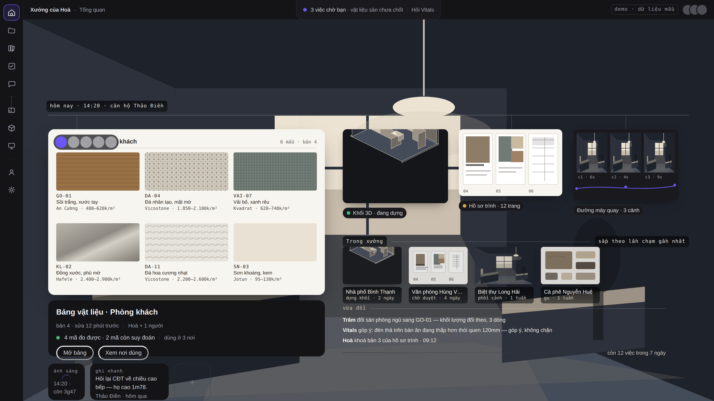 | 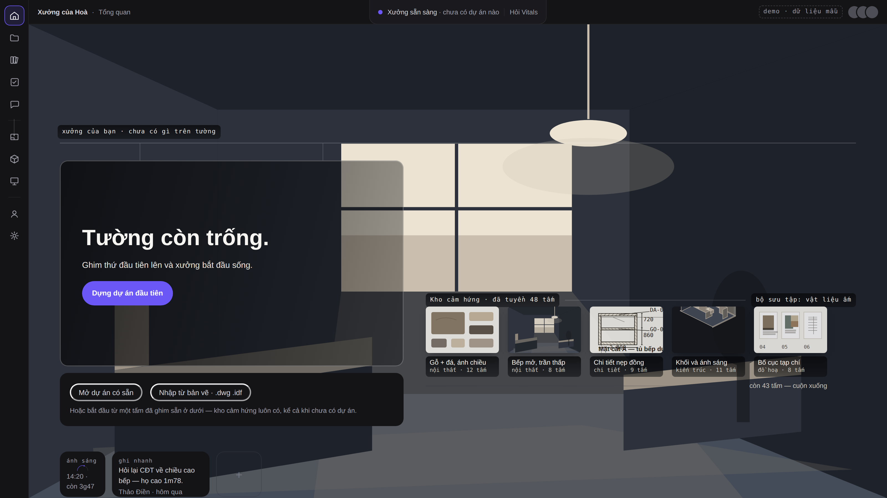 | 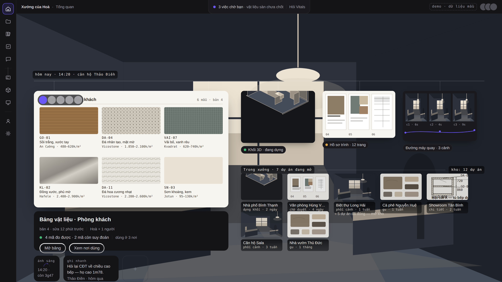 |

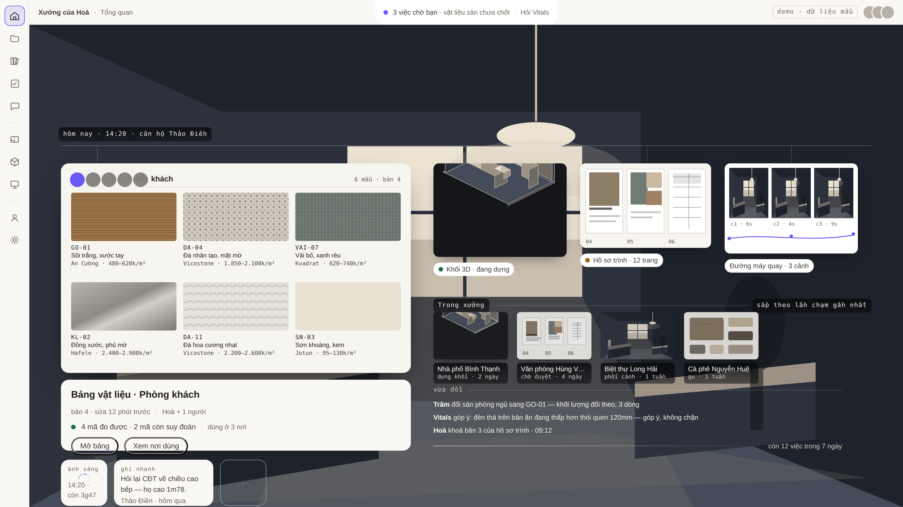

---

## H2 · PERSONAL STUDIO

**Cơ chế.** Home là **mặt bàn nhìn từ trên xuống**. Việc đang làm là **chồng giấy dưới tay bạn** —
tờ trên cùng mở hẳn, ba tờ dưới **ló đúng chân trang của chính nó** (bảng khối lượng ló ra dòng
tổng, phiếu duyệt ló ra "5/9 mục", ảnh hiện trường ló ra dòng số đo). Mọi thứ khác đặt **xa dần
theo tầm với** và **nén dần**: hiện vật đầy đủ → vật có nhãn → ô cỡ định sẵn → một dòng chữ.
Trục tầm với chạy trái→phải xuyên cả khung: *dưới tay · trong tầm mắt · trên kệ · ngoài kệ*.

**Rủi ro lớn nhất của chính nó.** Ẩn dụ vật lý phải **giữ được ở mọi ngày**. Ngày 7 dự án, chồng
giấy dưới còn ló 29px một tờ — nếu mai có 12 tờ thì cơ chế "ló chân trang" **hết chỗ**, và lúc đó
nó tụt xuống thành một danh sách. Đây là hướng dễ đẹp nhất nhưng cũng dễ vỡ nhất khi dữ liệu dày.

| ngày thường | xưởng rỗng | bảy dự án |
|---|---|---|
| 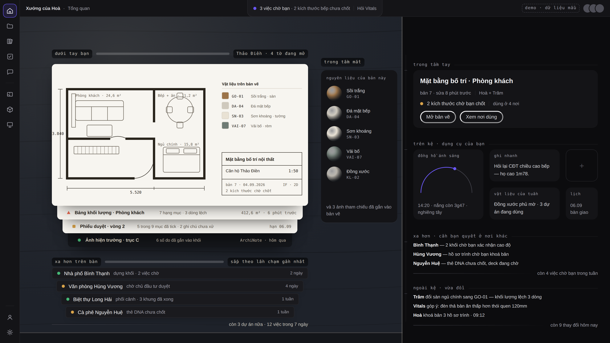 | 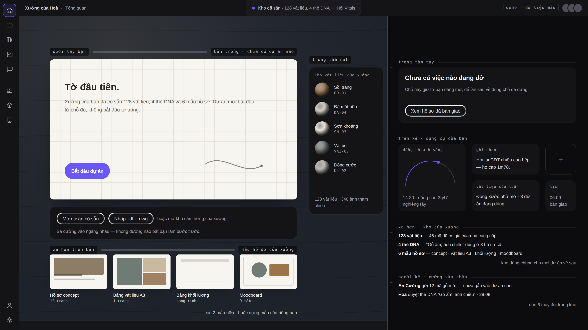 | 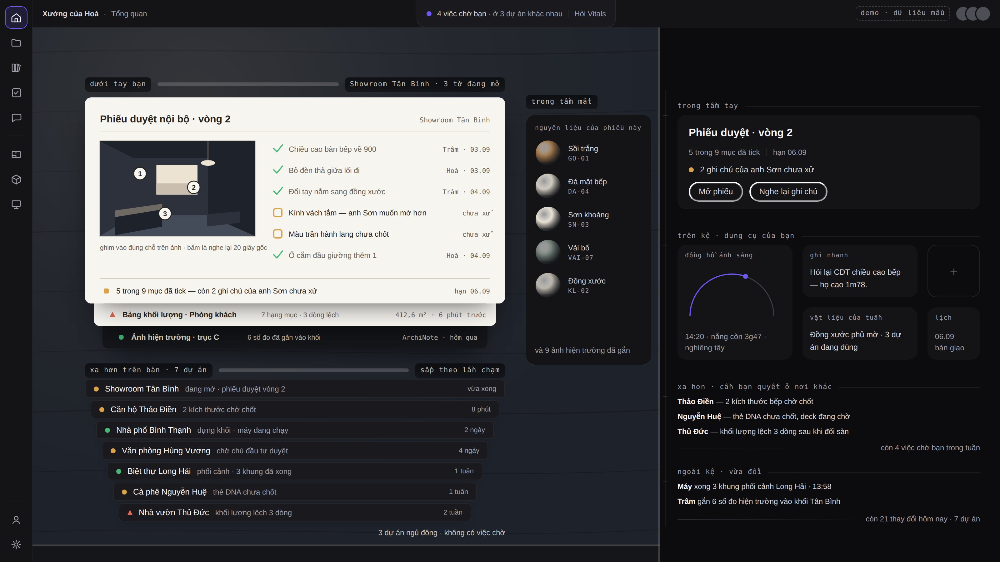 |

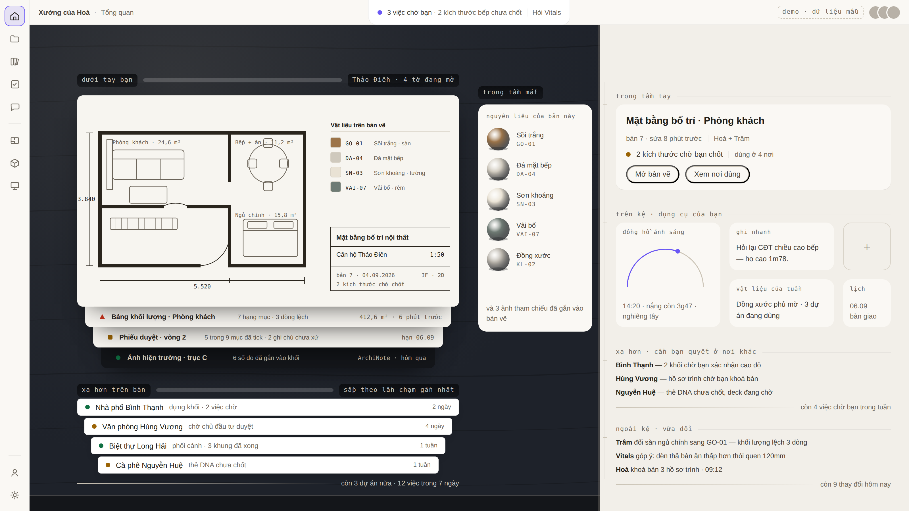

---

## H3 · QUIET DESKTOP

**Cơ chế.** Home là **một trang chữ có kỷ luật**. Tình hình xưởng viết thành **câu đọc được**, rồi
một **chỉ mục xếp theo mức cần bạn quyết** (*cần bạn quyết · máy đang chạy · chờ người khác*) —
không phải theo thời gian, không phải theo dự án. **Đúng một hiện vật được hiện hình** (thứ bạn
đang ở trong), tràn sát mép phải; phần còn lại tồn tại dưới dạng **chữ có số** cho tới khi được gọi về.

**Rủi ro lớn nhất của chính nó.** Nó **gần như bỏ môi trường** — trái câu "nền vẫn nên có hình".
Nếu Hoà thấy nó lạnh, thì đó là lạnh **do cơ chế**, không chữa được bằng màu hay bóng; phải đổi
hướng chứ không đánh bóng. Đổi lại, đây là hướng duy nhất máy phán được **100% chữ**
(0 đoạn không-đo-được, so với 6–14 của H2 và 23–28 của H1).

| ngày thường | xưởng rỗng | bảy dự án |
|---|---|---|
| 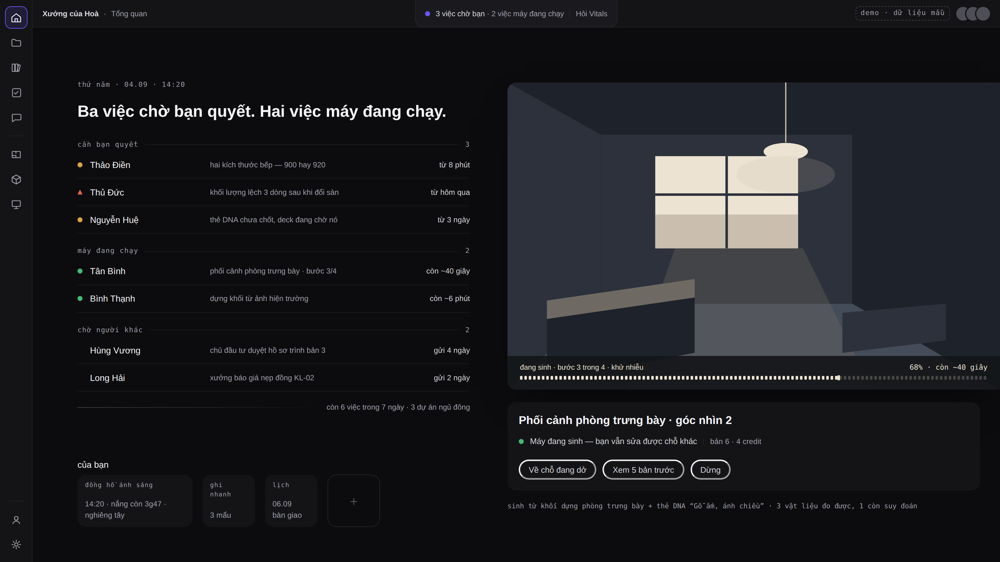 | 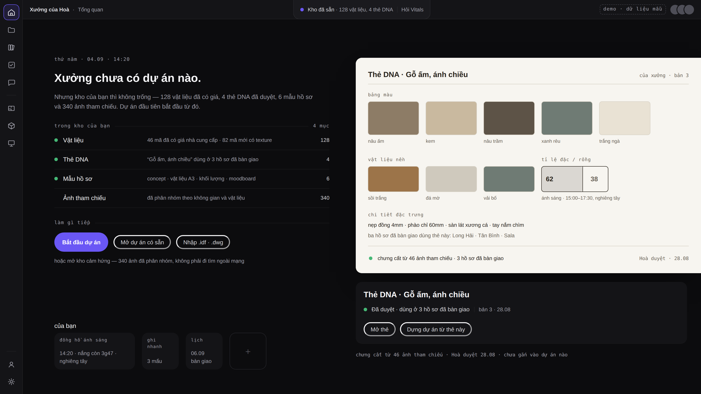 | 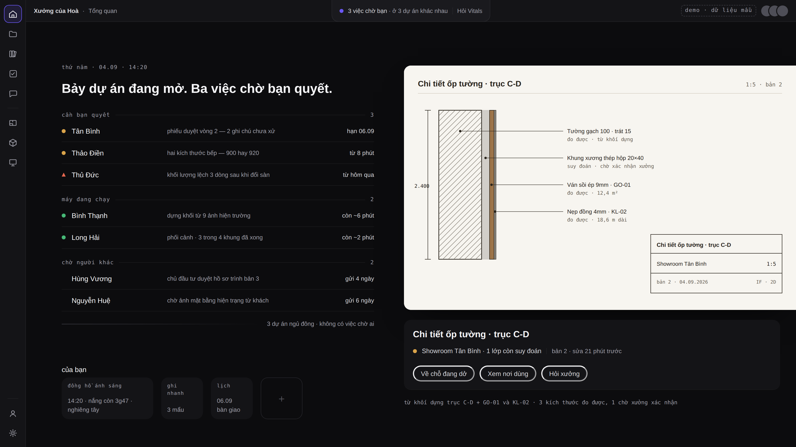 |

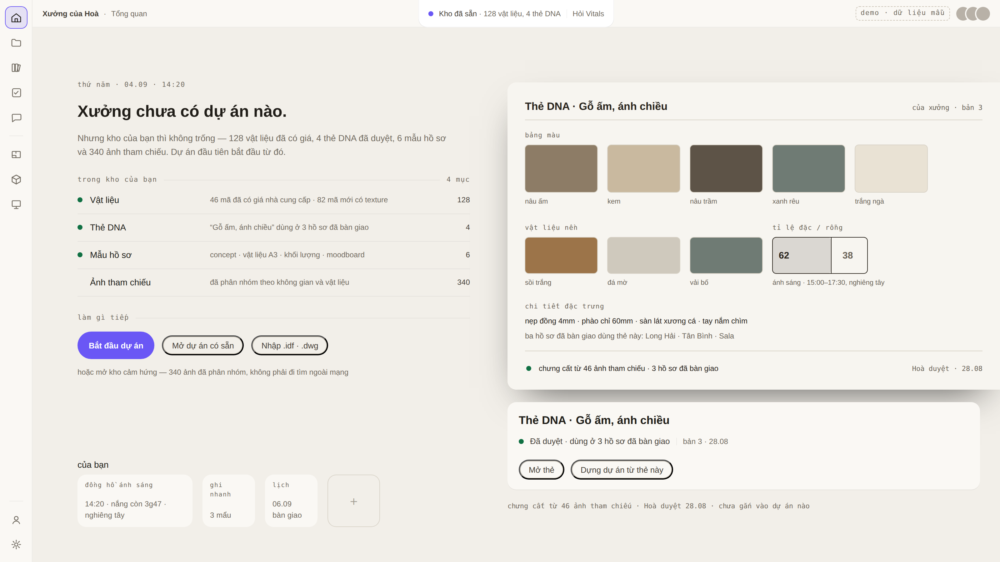

---

## Đối chiếu A–K (§5)

| | | H1 | H2 | H3 |
|---|---|---|---|---|
| A | ngày dày việc vẫn đọc được | ✅ | ✅ | ✅ |
| B | xưởng rỗng vẫn ra studio, `RESUME → BEGIN` | ✅ tường trống + kho cảm hứng | ✅ tờ giấy trắng + kho thật của xưởng | ✅ câu "kho không trống" + thẻ DNA |
| C | ≥7 dự án không vỡ | ✅ 7 bản in nhỏ | ⚠️ 7 mép giấy, **hết dư địa ở ~9** | ✅ 7 dòng chữ, còn dư địa |
| D | đủ loại mảnh việc sống | bảng vật liệu · khối 3D · deck · đường máy quay · moodboard | **mặt bằng 2D** · khối lượng · phiếu duyệt · ảnh hiện trường · mẫu hồ sơ | hàng đợi render · thẻ DNA · chi tiết cấu tạo |
| E | widget cỡ định sẵn 1×1·2×1·2×2 | ✅ | ✅ trên kệ | ✅ cuối cột chữ |
| F | khẩu độ Vitals ở mép trên | ✅ | ✅ | ✅ |
| G | nền động / wallgallery | ✅ mạnh nhất | ⚠️ chỉ ánh sáng bàn | ❌ **cố ý không có** |
| H | chữ × hình đọc được ở **mọi** ảnh | ⚠️ 23–28 đoạn phải soi mắt | ⚠️ 6–14 đoạn | ✅ 0 đoạn |
| I | tuỳ biến trong hàng rào DS | ✅ | ✅ | ✅ |
| J | chrome im lặng | ✅ | ✅ | ✅ nhất |
| K | là tổng quan cấp app, không phải màn hạ cánh của CAD | ✅ | ✅ | ✅ |

**Ba khung cộng lại bày 12 loại mảnh việc sống. Mặt bằng 2D xuất hiện ĐÚNG MỘT LẦN** (H2 · ngày thường).

---

## Bốn câu, mỗi câu trả lời bằng một từ

1. **Cơ chế nào?** — `H1` · `H2` · `H3` · `GHÉP` (nói ghép cái gì vào cái gì).
2. **Môi trường:** Home nên có **ảnh** (H1) · chỉ **ánh sáng** (H2) · **gần như không** (H3)?
3. **Thứ phụ:** xếp theo **tầm với** (H2) hay theo **mức cần quyết** (H3)?
4. **Khung rỗng:** bản nào ra "studio đang sống" nhất — `H1b` · `H2b` · `H3b`?

⛔ Chưa code dòng nào. Đây là vòng thiết kế; chọn xong mới mở phiếu thi công.
